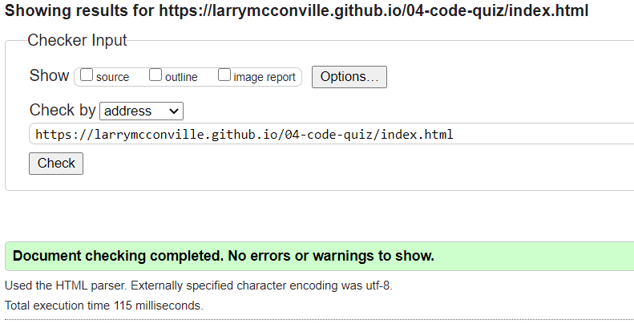

# [**04-CODE-QUIZ**](https://larrymcconville.github.io/04-code-quiz/)

## Project Goal

As new developers proceed in their journey to becoming a full-stack web developer, it’s likely that they will be asked to complete coding assessments/whiteboard exercises, perhaps as part of an interview process. A typical coding assessment is a combination of multiple-choice questions and/or interactive coding challenges.

To aid in becomming familiar with these tests and to provide one with a chance to apply the skills from this module, the objective of this project is to build a timed coding quiz with multiple-choice questions. The app will run in the browser, and will feature dynamically updated HTML and CSS powered by JavaScript. It should have a clean, polished, and responsive user interface.

## User Story

```
AS A coding boot camp student
I WANT to take a timed quiz on JavaScript fundamentals that stores high scores
SO THAT I can gauge my progress compared to my peers
```

## Acceptance Criteria

```
GIVEN I am taking a code quiz
WHEN I click the start button
THEN a timer starts and I am presented with a question
WHEN I answer a question
THEN I am presented with another question
WHEN I answer a question incorrectly
THEN time is subtracted from the clock
WHEN all questions are answered or the timer reaches 0
THEN the game is over
WHEN the game is over
THEN I can save my initials and score
```

## Solution

This project utilizes Bootstrap for CSS styling, a single HTML file, and a single JavaScript file, providing for a single page application. `Containers` are being utilized to group like elements and functionality, and to present a responsive design.

Code organization has all of the globally referenced `HTML` element mappings performed at the top followed by global `variables`, the `questionArray[]`, defining an empty `highscores[]`, and calling the `loadHighScores()` to perform an initial loading of highscores. The main body of the `script.js` file contains all of the functions, and at the bottom is all of the event listeners.

## Game Play Logic

### When the `start` button is clicked

- The `init` function is called.
- The `Begin Quiz`, `Show Scores` and `Clear Scores` buttons are hidden during game play.
- The `init` function initializes variables, and calls the `setTimer()` and `presentQuestion()` functions.

### `setTimer()`

- The `timer` is initialized with a 1000ms interval.
- The `timer` immediately starts counting down.
- When time expires or the end of the `questionArray[]` has been reached, the interval is cleared and the `quizOver()` is called.

### `presentQuestion()`

- Checks the length of the `questionArray[]`.
- Renders the question.
- `presentChoices()`.

### `presentChoices()`

- Calls `appendUlElement()` which serves as the anchoring parent `<ul>` for the `<li>` items.
- Loops through the choices for the current `questionArray[i]` and builds a dynamic list of `<li>` for _n_ choices.

### `appendUlElement()`

- Builds a `<ul>` for each new question.

### When the user selects an answer

- `ulContainer.addEventListener(click)` calls
  - `checkAnswer(`_with click target_`)`
  - `removeUlElement()`
  - `presentQuestion()`

`checkAnswer()`

- If player selected incorrect answer `secondsLeft` -=10
- Increment `question` variable ++

`removeUlElement()`

- Removes `<ul>` containing previous collection of `<li>` choices.

`ulContainer.addEventListener(submit)`

- Receives player's initials.
- declares a `newScore` object with player inititals and score.
- Pushes the `newScore` object to our in memory `highscores[]`.
- `saveHighScores`
- `loadHighScores()`
- `presentHighScores()`

`quizOver()`

- `removeUlElement()`
- `presentHighScores`
- `playerSubmit()`

`presentHighScores`

- Sorts the `highscores[]` in descending order so that we present highest scores at the top.
- Slices `highscores[]` into a `topFiveScores[]`.
- Loops through the `topFiveScores[]` creating `<li>` elements per n scores.

`playerSubmit()`

- Creates a `<form>`, a `<label>` and an `<input>` for user initials.

## HTML

A single `HTML` page represents all of the application functionality whereby the logic is distributed across three sections.

1 `<div class="jumbotron>` Presents questions to the user.

2 `<div class="container" id="ul-container">` Serves as the parent tag anchor for:

- `<li>` choice list
- `<li>` highscore list

3 `<div>` Containing the `Start`, `Show Score`, and `Clear Scores` buttons.

## CSS

[reset.css](http://meyerweb.com/eric/tools/css/reset/) Has been included to set a respective user's browser instance to a known state prior to applying application styling.

[Bootstrap](https://getbootstrap.com/) Has been utilized for class styling such as with containers where the `jumbotron` class has been applied.
local css

## Application Screen Shot


## Mock-Up

The following image shows the web application's appearance and functionality:


## Validation

The application `HTML` was scanned with the [Markup Validation Service](https://validator.w3.org/).


## Sources Referenced

[w3schools](https://www.w3schools.com/quiztest/quiztest.asp?qtest=JS) `|`
[Eloquent JavaScript](https://eloquentjavascript.net)
