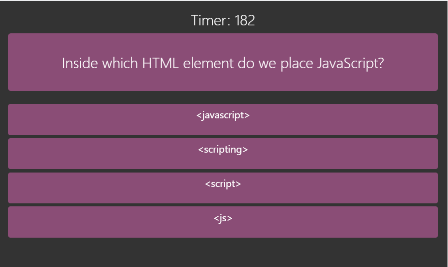

# [**04-CODE-QUIZ**](https://larrymcconville.github.io/04-code-quiz/)

## Project Goal

As new developers proceed in their journey to becoming a full-stack web developer, it’s likely that they will be asked to complete coding assessments/whiteboard exercises, perhaps as part of an interview process. A typical coding assessment is a combination of multiple-choice questions and/or interactive coding challenges.

To aid in becomming familiar with these tests and to provide one with a chance to apply the skills from this module, the objective of this project is to build a timed coding quiz with multiple-choice questions. The app will run in the browser, and will feature dynamically updated HTML and CSS powered by JavaScript. It should have a clean, polished, and responsive user interface.

## User Story

```
AS A coding boot camp student
I WANT to take a timed quiz on JavaScript fundamentals that stores high scores
SO THAT I can gauge my progress compared to my peers
```

## Acceptance Criteria

```
GIVEN I am taking a code quiz
WHEN I click the start button
THEN a timer starts and I am presented with a question
WHEN I answer a question
THEN I am presented with another question
WHEN I answer a question incorrectly
THEN time is subtracted from the clock
WHEN all questions are answered or the timer reaches 0
THEN the game is over
WHEN the game is over
THEN I can save my initials and score
```

## Solution

This project shall utilize Bootstrap for CSS styling, a single HTML file, and a single JavaScript file, providing a single page application. A container shall be placed on the page to represent the foundation of the responsive design.
The page shall have an `<h1>` with a welcome message.
The page shall have an `<h3>` with quiz instructions.
The page shall have a `start` button.
The page shall have a `timer` displayed.
The page shall have `questions` and `answers` displayed.

When the `start` button is clicked.

- The `setTimer` function is called.
- The `start` button changes to a `submit` button.
- The `presentQuestion` function is called.
- The question and answers posted to the page.
- The correct answer is loaded into the DOM.
- The tester will choose an answer.
- The tester will click the `submit` button.

When the `submit` button is clicked

- If the correct answer was selected
  - The tester is presented with a right answer selected message.
  - The score is incremented.
  - The `presentQuestion` function is called.
- If the wrong answer was selected
  - The tester is presented with a wrong answer selected message.
  - The timer is reduced by 10 seconds.
  - The `presentQuestion` function is called.

When the `timer` is zero

- The `quizOver` function is called.

The `setTimer` function

- The `timer` is initialized according to the number of questions in `question` array.
- The `timer` will start counting down.

The `presentQuestion` function

- The first question is loaded.
- The `presentAnswers` function is called.
- Subsequent calls will step through the questions.
- When no questions remain the `quizOver` function is called.

The `presentAnswers` function

- Receives the current `questionArray` index.
- Loads the related answers.
- Loads the related correct answer.

The `quizOver` function

- Remove the `submit` button.
- Present the testers score.
- Add testers score to `highScore` array.
- Question, answer and score variables are reset.

## HTML

A single `HTML` page represents all of the application functionality whereby the logic is distributed across three sections.

1 `<h4 class="jumbotron>` Presents questions to the user.

2 `<div class="container" id="ul-container">` Serves as the parent tag anchor for:

- `<li>` choice list
- `<li>` highscore list

3 `<div>` Containing the `Start`, `Show Score`, and `Clear Scores` buttons.

## CSS

[reset.css](http://meyerweb.com/eric/tools/css/reset/) Has been included to set a respective user's browser instance to a known state prior to applying application styling.

[Bootstrap](https://getbootstrap.com/) Has been utilized for class styling such as with containers where the `jumbotron` class has been applied.
local css

## Application Screen Shot



## Mock-Up

The following image shows the web application's appearance and functionality:


## Validation

The application html was scanned with the [Markup Validation Service](https://validator.w3.org/).

## Sources Referenced

[w3schools](https://www.w3schools.com/quiztest/quiztest.asp?qtest=JS) `|`
[Eloquent JavaScript](https://eloquentjavascript.net)
